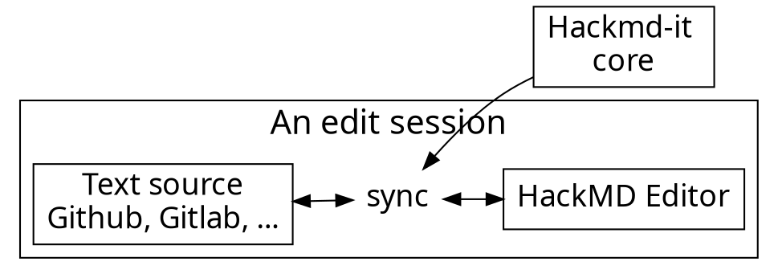

<!-- .slide: data-background="https://i.imgur.com/8rWMxe4.jpg" data-background-color="#0E0047" data-background-opacity="0.5"-->

<div style="margin-left:-100px; margin-top:-50px; width:1150px">

# Welcome to the class!

<!-- Put the link to this slide here so people can follow -->

## Ingeniería financiera (IF)
<br/>

Dr. Martín Lozano 

<a href='mailto:martin.lozano@udem.edu' style='color: orange;'>martin.lozano@udem.edu</a>.

* <a href="https://github.com/mlozanoqf" style="color: orange;">https://github.com/mlozanoqf</a>
* <a href="https://sites.google.com/site/mlozanoqf" style="color: orange;">https://sites.google.com/site/mlozanoqf</a>
<br/>
<div style="text-align: right"> Fall 2021 </div>

---

<!-- .slide: data-background="https://i.imgur.com/8rWMxe4.jpg" data-background-color="#0E0047" data-background-opacity="0.5"-->
<!-- .slide: data-transition="concave" -->
<div style="margin-left:-100px; margin-top:-50px; width:1150px">

# UDEM

Misión de la Escuela de Negocios: 

*Estamos comprometidos con una cultura de excelencia académica y con el desarrollo de líderes éticos conscientes de su responsabilidad social, dentro de un entorno global de negocios, con base en la generación, difusión y aplicación del conocimiento*.

---

<!-- .slide: data-background="https://i.imgur.com/M2lCepI.jpg" data-background-color="#0E0047" data-background-opacity="0.5"-->
<!-- .slide: data-transition="concave" -->
<div style="margin-left:-100px; margin-top:-50px; width:1150px">


---

### 70% of our users are developers. Developers :heart: GitHub.

---



---

### Usage flow

---




---

### Architecture of extension

---


---

## Content script

- Bind with each page
- Manipulate DOM
- Add event listeners
- Isolated JavaScript environment
  - It doesn't break things

---

# :fork_and_knife: 

---

<style>
code.blue {
  color: #337AB7 !important;
}
code.orange {
  color: #F7A004 !important;
}
</style>

- <code class="orange">onMessage('event')</code>: Register event listener
- <code class="blue">sendMessage('event')</code>: Trigger event

---

# :bulb: 

---

- Dead simple API
- Only cares about application logic

---

```typescript
import * as Channeru from 'channeru'

// setup channel in different page environment, once
const channel = Channeru.create()
```

---

```typescript
// in background script
const fakeLogin = async () => true

channel.answer('isLogin', async () => {
  return await fakeLogin()
})
```

<br>

```typescript
// in inject script
const isLogin = await channel.callBackground('isLogin')
console.log(isLogin) //-> true
```

---

# :100: :muscle: :tada:

---

### Wrap up

- Cross envornment commnication
- A small library to solve messaging pain
- TypeScript Rocks :tada: 

---

### Thank you! :sheep: 

You can find me on

- GitHub
- Twitter
- or email me
